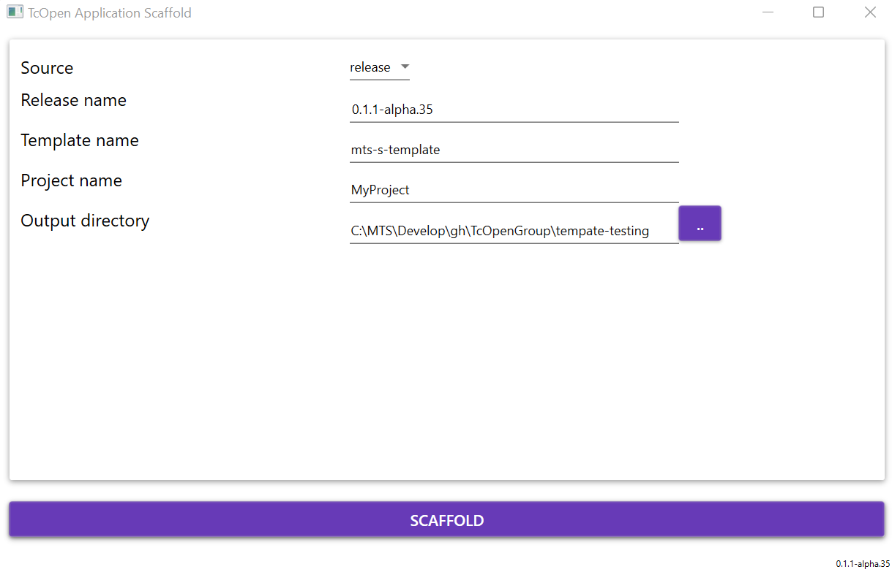

# TcOpen application templates

This repository contains templates for TcOpen applications, for you to get started quickly, with the development and deployment of your TcOpen applications.

## Pre-requisites

- [General pre-requisites TcOpen](https://github.com/TcOpenGroup/TcOpen#prerequisites)

For the specific requirements of a particular template see the readme of the template.

## Add TcOpenGroup package feed

To get early access to the packages from TcOpen we advise you to get access to a dedicated package feed hosted on GitHub. 
If you do not have a GitHub account please consider creating one by signing up at https://github.com.

~~~PowerShell
dotnet nuget add source --username <GITHUBUSERNAME> --password <PAT> --store-password-in-clear-text --name github-tcopen "https://nuget.pkg.github.com/TcOpenGroup/index.json"
~~~

How to create your Personal Access Token (PAT) read [here](https://docs.github.com/en/authentication/keeping-your-account-and-data-secure/creating-a-personal-access-token).

## Scaffolding from CLI

## Installing

~~~Powershell
dotnet tool install TcOpen.tco --global --version 0.2.1-preview.1
~~~

### Get help

~~~Powershell
PS C:\> .\tco.exe --help

  -b, --branch-tag          Branch from which draw the scaffold.

  -n, --project-name        (Default: MyProject) Project name.

  -n, --template-name       (Default: mts-s-template) Name of the template from which the project will be scaffolded.

  -o, --output-directory    Target directory for the scaffold.

  -r, --release             Release name.

  -s, --source              (Default: release) Source release or repository

  --help                    Display this help screen.

  --version                 Display version information.

~~~

### Example

Get mts-s-template from the repository
~~~Powershell
tco --project-name MyNewProject --template-name mts-s-template --source repository --release 0.2.0-alpha.9
~~~

## Scaffolding from ui program

1. Go to the releases in this repository [here](https://github.com/TcOpenGroup/tcopen-app-templates/releases).
1. Open the latest release. 
1. From **Assets** Download the latest version of *TcOpen.Scaffold.UI.zip*, copy it to an empty folder and unzip.
1. Run *TcOpen.Scaffold.UI.exe*. 

> **You may get a security warning about the executing file download from the internet. We will provide singed binaries later in the development process. If you have reason to distrust this binary, you can compile your version from the source of this repository.**

## Available project templates

|    Template id    |                                           Description                                            |
| ----------------- | ------------------------------------------------------------------------------------------------ |
| mts-s-template    | Standard template for [MTS](https://www.mts.sk/en/) more in the readme of the template  [templates\mts-s-template](templates/mts-s-template/t/README.md)|
| more coming soon | -                                                                                                |

