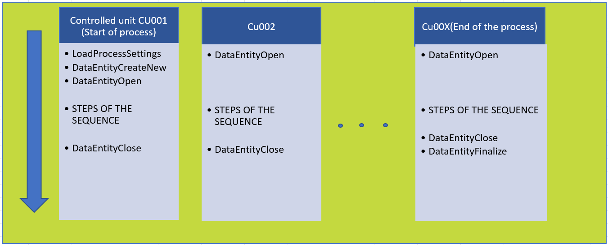

# MTS standard application tempalte 
# `mts-s-template`

## Foreword

The TcOpen group if funded by [MTS](https://www.mts.sk) to develop this application for its own use. We are also making it freely available to the wider community for use or inspiration.

The application template will therefore be developed primarily to meet the needs of MTS. We will of course accept input from the community, but some limits may be imposed on any changes of this particular template.
However, TcOpen will develop different application templates that will be more open to change from the community.

## Prerequisites

### TcOpen framework prerequisites

Checkout general prerequisites for TcOpen framework [here](https://github.com/TcOpenGroup/TcOpen/blob/dev/README.md#prerequisites).

### Template-specific prerequisites

- This template uses RavenDB for storage, **embedded** into the application (for convenience), thus you will need [to register the installation](https://ravendb.net/buy). There is a community edition that you can use for free.
- Embedded instance is good for testing and commissioning, however, in production you should use a non-embedded instance. Instructions [here](https://github.com/TcOpenGroup/TcOpen/tree/dev/src/TcoData/src/Repository/RavenDb#how-to-install-it).

## Overview

This application aims to provide scaffolding for automated production/assembly machinery such as:

- single assembly station.
- a group of standalone assembly stations with an ID system.
- conveyor-based assembly and testing lines with an ID system.
- carousel tables with an ID system.

The production environment is represented by a series of hierarchically organized units where:

> **Technology** encapsulates all stations/units and it is the root/top-level block.
>> **Controlled unit** represents a station or a unit that performs compact series of operations.

>>>**Components** represent all physical or virtual components used by the Controlled unit.

>>>**Tasked sequences** represent a series of actions organized sequentially (controlled unit contains by default ground and automat sequence).

>>>**Tasked services** represent a series of actions organized arbitrarily (controlled unit contains by default manual/service tasked service).

## Data-driven production process

The production flow is typically organized in sequences driven by a set of data called **Production settings**.

- `Production settings`  is a structure that contains settings to instruct the production flow (inclusion/exclusion of actions, limits, required values, etc.) as well as placeholders for data that arise during the production (measurement values, detected states, data tags of included components, etc.). Production setting and traceability data have the same structure so that settings and traced data are collected in a single data set.


- `Technological settings` is a structure containing data that does not relate directly to the production process, but rather to the setting of the technology (sensor calibration values, pick and place positions, etc.)


### Data and production flow

The first station (controlled unit) in the production chain loads the current set of production data to the assembly parts, that are assigned to that part. The data set contains information about the entire production process (all station settings are included).

#### Entity header

Each part has an *Entity header* that contains information about the flow and status of the given part.


- `Recipe` contains the name of the production setting data set.
- `Recipe created` date and time of recipe creation.
- `Recipe modified` date and time of last recipe modification.
- `Carrier` is the identifier of the mean of transport of the production part (pallet, carousel table position, etc).
- `Reset or ground position performed` indicates when station reset occurred while the part was at the station.
- `Is Master` indicates that the part is special (verification, process checking etc.)
- `Is Empty` indicates that the carrier is empty, no parts were loaded.
- `Last station` is the last station where the part was processed in the production chain.
- `Next station` is the next destination station for the part to be processed.
- `Operations Opened` Indicates the station where the part is being processed.
- `Result` Indicates the status of the part (NoAction, InProgress, Passed, Failed)
- `Failures` verbatim description of failures that occurred during the processing of the part.
- `ErrorCodes` error codes that occurred during the processing of the part.
- `Was reworked` indicates that the part underwent rework.
- `Last rework name` name of the rework applied to the part.
- `Rework count` number of times the part has undergone reworks.


#### Controlled unit header

Each station (controlled unit) has a header that contains a set of information:


- `Next station on fail` sets where the part should go when the process on a given station fails.
- `Next station on passed` sets where the part should go when the process passes.
- `Cycle time` cycle time on a given station when the part was processed.
- `Clean loop time` clean cycle time (without carrier exchange) on a given station when the part was processed.
- `Operation started`  start operations time stamp on a given station.
- `Operation ended` end operations time stamp on a given station.
- `Operator` name or id of the operator logged into the given station while the part was processed.

### How data is handled on the stations (controlled units)

**Creating entity**: The first station in the chain of production loads *Process settings* to the part (entity) and opens the part for production (Result := InProgress).

**Opening entity**: Each consecutive station retrieves the data of the given part by its ID then checks whether it belongs to the station by checking that EntityHeader.NextStation matches the ID of the station. If the NextStation and ID match the station will start its operation on the part, otherwise it will be released from the station without performing any tasks. If the station executes its operations on the part it will record it to the Entity Header (assigns id of the station to Entity header's Operations Opened). The process adheres to the settings available for the station. During the process the station also fills in the traceability data (measurements, detection, ids of assembled parts, etc.).

**Closing entity**: At the end of the operation the part data structure is closed for editing and the NextStation is assigned (depending on the result of the operations). The data are pushed back to a data repository for later retrieval in the next station.

**Finalizing entity**: The last station in the production chain should finalize the part when the **InProgress** result changes into the overall result **Passed**, while the failed result remains marked as **Failed**.

A special case occurs if **reset or ground position** is triggered on a station. When the station is reset while operations on a part are in progress (Operation Opened is a station ID) then the reset results in the entity being marked as failed. If the station is reset and operations are not in progress then the status of the entity is not modified.

# Application template architecture

The application's entry point is the `MAIN` program called cyclically from the PLC task. 
`MAIN` declares the instance of the `Technology` type that is the context of the whole application. You should place all your code within the `Main` method of technology object (`_technology.Main()`) that will contextualize all your code.

If you are not familiar with the architecture of the TcOpen framework `context` concept, you can find more 
[here](https://docs.tcopengroup.org/articles/TcOpenFramework/TcoCore/TcoContext.html) or a more generic overview [here](https://docs.tcopengroup.org/articles/TcOpenFramework/TcoCore/Introduction.html).

*Following video introduces the application context*

[](http://www.youtube.com/watch?v=Nr8Y-5GHSxE)

# Technology object

`Technology` is **top/root object** of a comprehensive whole (production line, series of devices chained in an orderly fashion) that controlled by one PLC. The `technology` contains `controlled units` representing sufficiently autonomous parts of the technology (e.g., stations, devices, etc.).

## Technology commands

### GroundAll

The task that provides execution of the ground task to all controlled units within the technology. The ground task of each controlled unit should contain the control logic that brings the respective controlled unit into its initial state.

### AutomatAll

The task that provides the execution of the automatic task to all controlled units within the technology. Automat task provides each controlled unit's nominal (automatic) cycle logic.


## Controlled units

The technology can contain multiple controlled units. The controlled unit has different `modes`: 
- **Ground**: brings the device into its initial state (home position, state resets, etc.). The ground mode can contain subsequences for parallelization or organization of logic.
- **Automat**: represents the standard run of the unit. Automat mode is of sequence type. The automat mode can contain subsequences for parallelization or organization of logic.
- **Manual**: provides access to a series of tools to manipulate single components of the controlled unit.

>More about sequences: [formal explanation](https://docs.tcopengroup.org/articles/TcOpenFramework/TcoCore/TcoSequencer.html), [informal explanation](https://docs.tcopengroup.org/articles/TcOpenFramework/howtos/How_to_write_a_sequence/article.html)

>More about tasks: [formal explanation](https://docs.tcopengroup.org/articles/TcOpenFramework/TcoCore/TcoTask.html).

Controlled units also contain two main structures:

- **Components** encapsulates components (drives, sensors, pneumatical cylinders, etc.)
- [**ProcessData**](#processdata) is a PLC's working copy of its recipe and traceability data combined, that is kept in a repository ([TcoData](https://docs.tcopengroup.org/articles/TcOpenFramework/TcoData/Introduction.html)).


## ProcessData

This application template provides a versatile model to allow for the extended control of the program flow from a manageable data set. Process data represent the set of information to follow and process during production. One way of thinking about the process data is as the recipe that, besides the instructive data, contains information that arises during the production process. Production data are filled into the data set during the production operations.

Typically, the process data are loaded at the beginning of the production into the first controlled unit (station). Then, an Id of the production entity is assigned and stored in the data repository. Each controlled unit (station) later retrieves the data for the given entity at the beginning of the process and returns the data (enriched by additional information about the production) to the repository at the end of the process.

## TechnologicalData

Technological data contain a manageable set of data related to the technology used, such as drives settings, limits, global timers, etc. 

## ProcessTraceability

Process traceability is a PLC placeholder for accessing the production data repository. This object points to the same traceability repository as the `ProcessData` of any controlled unit.

# Controlled unit templates
Controlled unit `CU00X` is a template from which other controlled units can derive.
`CU00X` folder contains a template from which any controlled unit can be scaffolded. There is PowerShell script `Create-Controlled-Unit` located in the root of the solution directory for this purpose.

~~~
.\Create-Controlled-Unit.ps1 NEWCU
~~~

> The script may not work as expected when the solution is opened as filtered solution (slnf).

Running the script will modify the PLC project files; if the project is opened in the visual studio a project reload will be required. In addition, you will need to add the call of the newly added controlled unit in the `Technology` manually.

~~~
FUNCTION_BLOCK Technology EXTENDS TcoCore.TcoContext
VAR
    _processSettings     : ProcessDataManager(THIS^);
    _technologySettings  : TechnologicalDataManager(THIS^);
    _processTraceability : ProcessDataManager(THIS^);
    {attribute addProperty Name "<#AUTOMAT ALL#>"}
    _automatAllTask : TcoCore.TcoTask(THIS^);
    {attribute addProperty Name "<#GROUND ALL#>"}
    _groundAllTask : TcoCore.TcoTask(THIS^);
    _cu00x         : CU00x(THIS^);
    
    _NEWCU : NEWCU(THIS^); <------ NEWLY ADDED
END_VAR
//-----------------------------------------------------

Main() <------ ATTENTION NOT BODY OF THE FUNCTION BLOCK BUT Main() METHOD!!!
//----------------------------------------------------
_processSettings();
THIS^.RtcSynchronize(true, '', 60);
_cu00x();

_NEWCU();  <------ NEWLY ADDED

//----------------------------------------------------
~~~

# Data handling #

The usage of methods for  handling `ProcessData` are described on picture below. Controlled unit in template has a basic scheme for data handling. On first controlled unit is necessary load a `LoadProcessSettings`(Recipe). This method is usually used on first at Cu001(start of process) or can be called on each controlled unit. 

If there is a Process traceability and  PLC is placeholder for accessing the production data repository, then is necessary call `DataEntityCreateNew` with specified `_entityId`. The method  `EntityDataOpen` load data from repository and check flow in header. If entity belongs to controlled unit sequence can start (operation start time stamp, user info, etc are populated in header). This method is usually called on each stations at beginning of the sequence. 

`DataEntityClose` is typically used after all operation on the technology are completed (operation end time stamp, user info, flow to next and etc are populated in header).




## LoadProcessSettings ##
 
 Typically used in the first station of the technology to load process settings that will be used trough out the production
~~~
				   
	IF(Station.Technology.ProcessSettings.Data._EntityId <> '' AND NOT THIS^._missingProcessSettingMessage.Pinned) THEN
		IF(Station.Technology.ProcessSettings.Read(Station.Technology.ProcessSettings.Data._EntityId).Done) THEN
			Station.ProcessDataManager.Data := Station.Technology.ProcessSettings.Data;
			Station.ProcessDataManager.Data.EntityHeader.RecipeCreated := Station.Technology.ProcessSettings.Data._Created;
			Station.ProcessDataManager.Data.EntityHeader.RecipeLastModified  := Station.Technology.ProcessSettings.Data._Modified;
			Station.ProcessDataManager.Data.EntityHeader.Recipe  := Station.Technology.ProcessSettings.Data._EntityId;				
			Station.ProcessDataManager.Data._EntityId := ULINT_TO_STRING(Context.RealTimeClock.TickClock());
			CompleteStep();

		END_IF;	
	ELSE
		IF(_dialog.Show()
	       .WithCaption('<#Process data not selected#>')
		   .WithText('<#Would you like to load default settings?#>')
		   .WithYesNoCancel().Answer = TcoCore.eDialogAnswer.Yes) THEN
		   
		   	Station.Technology.ProcessSettings.Data._EntityId := 'default';
		END_IF; 

			
	END_IF		    				
~~~

## DataEntityCreateNew ##
 Creates new data entity (new part/item). Typically used in the first station of the technology to create new document/record to be persisted in the repository.Sets the status of the entity to `InProgress`

~~~
THIS^.DataEntityCreateNew(200, Station.ProcessDataManager.Data._EntityId, Header := Station.ProcessDataManager.Data.CU00x.Header); END_IF;
~~~

## EntityDataOpen ##
Populates the information in the data header of this controlled unit (operation start time stamp, user info, etc) Typically used prior to starting operation within a controlled unit.
~~~
THIS^.DataEntityOpen(300,30000, Station.ProcessDataManager.Data._EntityId,Station.ProcessDataManager.Data.CU00x.Header)
~~~

## DataEntityClose ##

Populates the information in the data header of this controlled unit (operations end time stamp, user info, etc). Typically used after all steps within the controlled unit are completed.

The status of the entity is still **'InProgress'**

~~~
IF(_dataClose) THEN THIS^.DataEntityClose(5000, eDataEntityInvokeType.InvokeAndWaitDone ,Station.ProcessDataManager.Data.CU00x.Header); END_IF;
~~~


## DataEntityFinalize ##
 Same as `DataCloseEntity` populates the information in the data header of this controlled unit (operations end time stamp, user info, etc)
 Typically used after all operation on the technology are completed (end of the process).
 

Sets the status of the entity to **Passed**

~~~
THIS^.DataEntityFinalize(5500,eDataEntityInvokeType.InvokeOnly,Station.ProcessDataManager.Data.CU00x.Header);
~~~

**Note!**
- If input enum parameter in methods `DataCloseEntity` and `DataCloseFinalize`  is set to **InvokeAndWaitDone**  operation will  wait until task reaches the ```Done``` state .

 - If input enum is set to **InvokeOnly** results return True when  task reaches the ```Busy``` state .This option is used when we need to reduce cycle time. Later is recommended (necessary) to check  task  ```Done``` state  , check  task  status. 

    ~~~
    //save data
    THIS^.DataEntityFinalize(5500,eDataEntityInvokeType.InvokeOnly,Station.ProcessDataManager.Data.CU00x.Header);


    //some steps (robots, cylinder to home positions...)

    //later check if saving data process is done
    IF (Step(20000,TRUE , 'WAIT FOR IF DATA FINALIZE IS DONE')) THEN
        //-------------------------------------

            StepCompleteWhen(Station.UpdateEntityTask.Done );
        
        //-------------------------------------	
    END_IF
    ~~~


 # Notification panel #   

Use of this visual component is provide to a brief overview of `Technology`.  Essential signals in Technology such a **Control Voltage, Air pressure, Safety....** are displayed on this panel on *Main Screen*. 


Component is populated from plc   and  provide simple diagnostic if technology is ready for operation. 

~~~
//notification panel
//messanging is suspensded 
 Context.Environment.Messaging.Suspend();
			
_closed:=TRUE;
//_closed   := 	Components.Safety.DoorCircuits.DoorCircuit_2.IsClosed 
//			AND Components.Safety.DoorCircuits.DoorCircuit_3.IsClosed  
//			AND Components.Safety.DoorCircuits.DoorCircuit_4.IsClosed  
//			AND Components.Safety.DoorCircuits.DoorCircuit_5.IsClosed  
//			AND Components.Safety.DoorCircuits.DoorCircuit_6.IsClosed;

 _locked:=TRUE;
//_locked   := 	Components.Safety.DoorCircuits.DoorCircuit_2.IsLocked 
//			AND Components.Safety.DoorCircuits.DoorCircuit_3.IsLocked  
//			AND Components.Safety.DoorCircuits.DoorCircuit_4.IsLocked  
//			AND Components.Safety.DoorCircuits.DoorCircuit_5.IsLocked  
//			AND Components.Safety.DoorCircuits.DoorCircuit_6.IsLocked;
			
_keysAto  := TRUE;
_eStopActive:=0;


_notificationSourceSignals.ControlVoltage   := TRUE;//Components.ControlVoltage.Signal.Signal 
_notificationSourceSignals.AirPressure      := TRUE;//Components.AirPressureOk.Signal.Signal, 
_notificationSourceSignals.AutomatAllowed   := _keysAto; 
_notificationSourceSignals.EmergencyStop    := _eStopActive > 0; 
_notificationSourceSignals.SafetyDoorOk     :=safetyCircuitOk;	
_notificationSourceSignals.LightCurtain     := TRUE; 	// not used
_notificationSourceSignals.DoorClosed       := _closed; 
_notificationSourceSignals.DoorLocked       := _locked; 
_notificationSourceSignals.ProcessDataOk    := _processSettings._data._EntityId <> '';
_notificationSourceSignals.TechnologyDataOk := _technologySettings._data._EntityId <> '';  
	
_notificationPanel(inBlinkPeriod:=T#500MS , inSignalSource:=_notificationSourceSignals );
			
 Context.Environment.Messaging.Resume();

~~~
**Note!**
It is possible to use like a **sub module diagnostic** (only one Cu, group of Cu or whole Technology)

